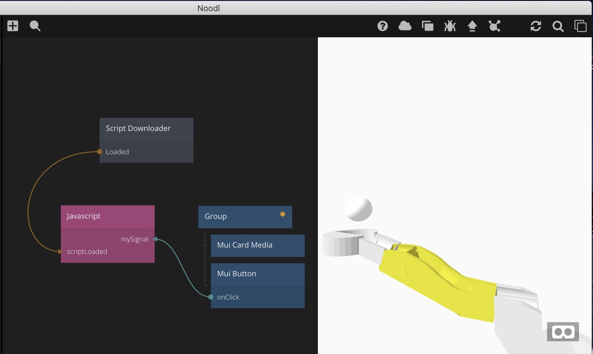

# noodl202_3dcgviewer_A-Frame
How to show a-frame on Noodl 2.0.2

# Preparation

## Get 3Dmodel

3Dmodel is included the repository. The author is myself.  

## Get Noodl 2.0.2

Noodl 2.0.2 is beta version.  

Registration is required. Check the airticle.   
https://qiita.com/noodl-tokyo/items/e8d9e945c60433019026

# Instruction

1. Run Noodl and "importing exisiting project".  

2. Select the project folder.  

3. Check preview. Press "Click me" button under the preview area.  
(It is hard to see)  

4. You can 3DCG view on a-frame.